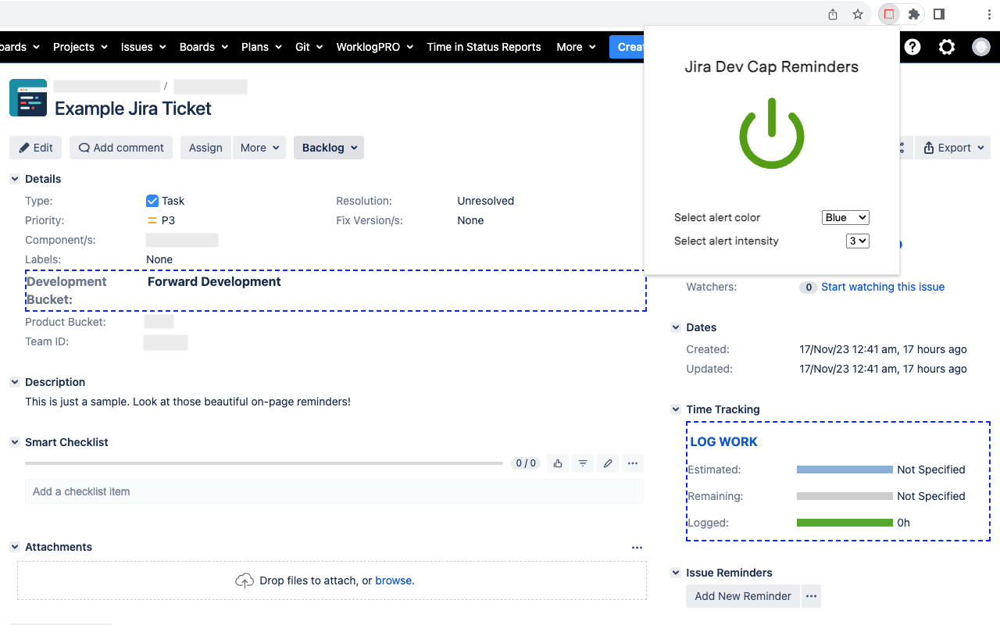

# Jira Dev Cap Reminders

A browser extension to enable customizable on-page reminders to log work on 'Forward Development' Jira tickets. Please note this extension only works within my company's instance of Jira. Downloadable via the following extension marketplaces:

- [Firefox](https://addons.mozilla.org/en-US/firefox/addon/jira-dev-cap-reminders/)
- [Chrome](https://chromewebstore.google.com/detail/jira-dev-cap-reminders/gahkcepgmdadhehbihobcofambmpmcgk?hl=en)
- Edge - See [these instructions](https://support.microsoft.com/en-us/microsoft-edge/add-turn-off-or-remove-extensions-in-microsoft-edge-9c0ec68c-2fbc-2f2c-9ff0-bdc76f46b026#ID0EDL) to install the [Chrome extension](https://chromewebstore.google.com/detail/jira-dev-cap-reminders/gahkcepgmdadhehbihobcofambmpmcgk?hl=en) directly into Edge

## Add-on in action:
